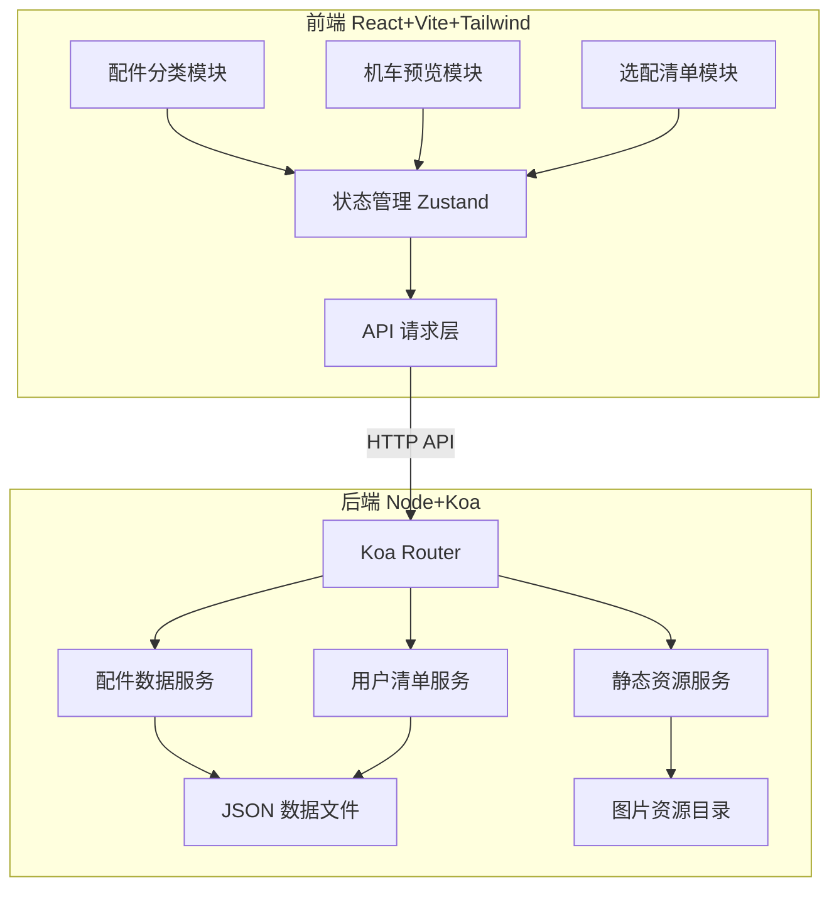
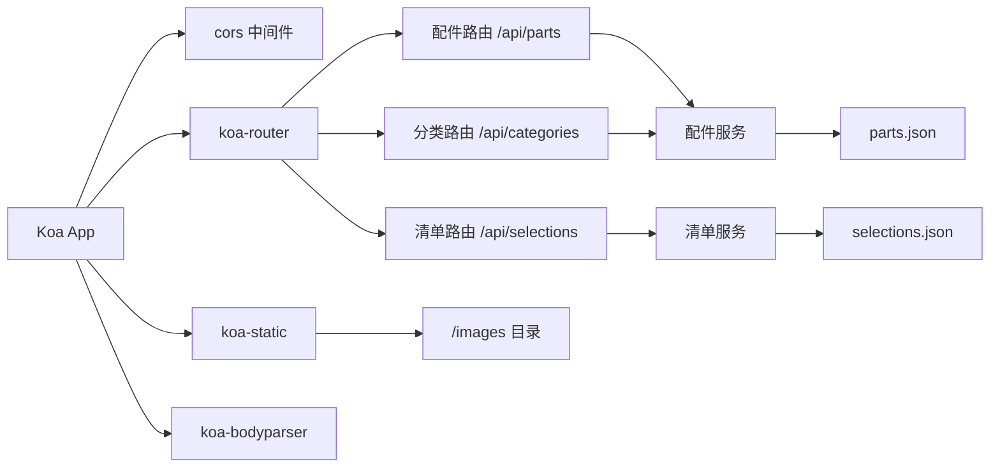
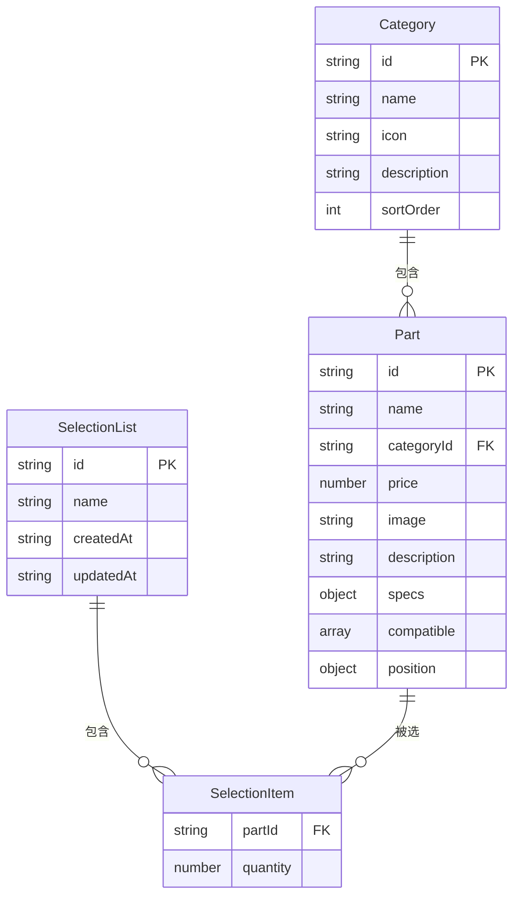

## 1. 架构设计



## 2. 技术说明

- 前端: React@18 + TailwindCSS@3 + Vite + TypeScript
- 初始化工具: vite-init
- 后端: Koa@2 + koa-router + koa-cors + koa-static + TypeScript
- 数据库: 本地 JSON 文件存储
- 包管理器: npm

## 3. 路由定义

| 路由 | 用途 |
|------|------|
| / | 首页 - 配件分类浏览 |
| /preview | 机车预览页 - 可视化搭配 |
| /list | 选配清单页 - 清单管理 |

## 4. API 定义

### 4.1 配件数据接口

```typescript
interface Part {
  id: string
  name: string
  category: string
  price: number
  image: string
  description: string
  specs: Record<string, string>
  compatible: string[]
  position: { x: number; y: number; width: number; height: number }
}

// GET /api/parts - 获取所有配件
// GET /api/parts?category=exhaust - 按分类筛选
// GET /api/parts/:id - 获取配件详情
// GET /api/categories - 获取所有分类
```

### 4.2 用户清单接口

```typescript
interface SelectionItem {
  partId: string
  quantity: number
}

interface SelectionList {
  id: string
  name: string
  items: SelectionItem[]
  createdAt: string
  updatedAt: string
}

// GET /api/selections - 获取所有清单
// POST /api/selections - 创建清单
// PUT /api/selections/:id - 更新清单
// DELETE /api/selections/:id - 删除清单
// POST /api/selections/:id/items - 添加配件到清单
// DELETE /api/selections/:id/items/:partId - 从清单移除配件
```

### 4.3 图片资源接口

```
// GET /images/parts/:filename - 配件图片
// GET /images/bike/:filename - 机车图片
// 静态资源由 koa-static 直接服务
```

## 5. 服务端架构图



## 6. 数据模型

### 6.1 数据模型定义



### 6.2 数据定义

```json
// parts.json 结构
{
  "categories": [
    { "id": "exhaust", "name": "排气系统", "icon": "wind", "description": "排气管、消音器等", "sortOrder": 1 },
    { "id": "wheels", "name": "轮毂轮胎", "icon": "circle", "description": "轮毂、轮胎等", "sortOrder": 2 },
    { "id": "handlebar", "name": "把手控制", "icon": "grip-horizontal", "description": "把手、后视镜等", "sortOrder": 3 },
    { "id": "lighting", "name": "灯组照明", "icon": "lightbulb", "description": "大灯、尾灯、转向灯", "sortOrder": 4 },
    { "id": "bodykit", "name": "车身套件", "icon": "shield", "description": "挡泥板、侧板、油箱贴花", "sortOrder": 5 },
    { "id": "brake", "name": "制动系统", "icon": "disc", "description": "刹车盘、卡钳、刹车片", "sortOrder": 6 }
  ],
  "parts": [
    {
      "id": "exhaust-001",
      "name": "钛合金直排排气管",
      "categoryId": "exhaust",
      "price": 3200,
      "image": "/images/parts/exhaust-001.jpg",
      "description": "全钛合金材质，直排设计，减重3.5kg",
      "specs": { "材质": "钛合金", "重量": "2.1kg", "长度": "85cm", "口径": "60mm" },
      "compatible": ["street", "sport"],
      "position": { "x": 65, "y": 55, "width": 25, "height": 8 }
    }
  ]
}

// selections.json 结构
{
  "selections": [
    {
      "id": "sel-001",
      "name": "我的改装方案",
      "items": [
        { "partId": "exhaust-001", "quantity": 1 }
      ],
      "createdAt": "2026-06-13T00:00:00Z",
      "updatedAt": "2026-06-13T00:00:00Z"
    }
  ]
}
```
